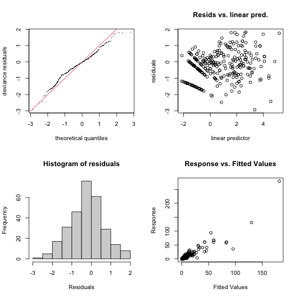
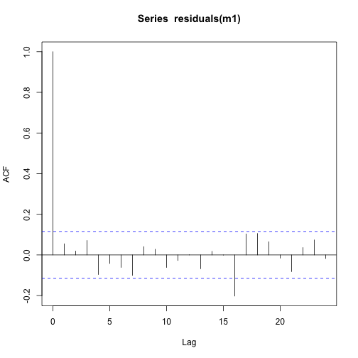
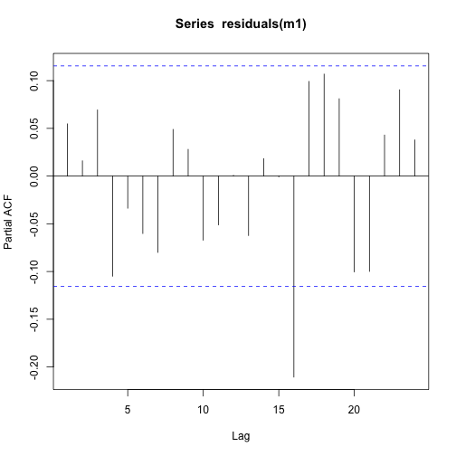
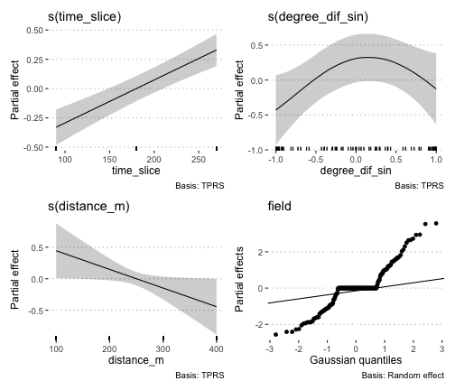

## Load libraries


```r
library("tidyverse")
library("ggpubr")
library("gratia")
library("here")
library("mgcv")
theme_set(theme_pubclean())
```

## Spore proportion chi-squared analysis

Check if the spore type, number of nuclei, affects the dispersal.


```r
set.seed(3)
read_csv(here("data/spore_type.csv"),
         show_col_types = FALSE) %>%
  group_by(meter, spore_nuclei) %>%
  summarise(n = sum(count), .groups = 'drop') %>%
  spread(spore_nuclei, n) %>%
  column_to_rownames('meter') %>%
  chisq.test(simulate.p.value = TRUE) 
```

```
## 
## 	Pearson's Chi-squared test with simulated p-value (based on 2000 replicates)
## 
## data:  .
## X-squared = 20.656, df = NA, p-value = 0.1959
```

## Spore dispersal GAM Model

### Load data


```r
load(here("data/mod_dat.Rdata"))
```

### Inspect the mod_dat object


```r
mod_dat %>% # str
  distinct(field, trap_coord, .keep_all = TRUE) %>%
  select(trap_coord,
         trap_degrees,
         degree_dif,
         wind_degrees,
         wind_speed,
         distance_m) %>%
  print(n = Inf)
```

```
## # A tibble: 24 × 7
## # Groups:   field [6]
##    field trap_coord trap_degrees degree_dif wind_degrees wind_speed distance_m
##    <fct> <chr>             <dbl>      <dbl>        <dbl>      <dbl>      <dbl>
##  1 1     N                     0    -76.2          76.2        1.49        100
##  2 1     E                    90     13.8          76.2        1.49        100
##  3 1     W                   270    194.           76.2        1.49        100
##  4 1     S                   180    104.           76.2        1.49        100
##  5 2     N                     0   -201.          201.         7.27        100
##  6 2     E                    90   -111.          201.         7.27        100
##  7 2     W                   270     68.7         201.         7.27        100
##  8 2     S                   180    -21.3         201.         7.27        100
##  9 3     NE                   45    -90.3         135.         2.93        100
## 10 3     SE                  135     -0.313       135.         2.93        100
## 11 3     NW                  315    180.          135.         2.93        100
## 12 3     SW                  225     89.7         135.         2.93        100
## 13 4     N                     0    -35.9          35.9        3.90        100
## 14 4     E                    90     54.1          35.9        3.90        100
## 15 4     W                   270    234.           35.9        3.90        100
## 16 4     S                   180    144.           35.9        3.90        100
## 17 5     NE                   45     15.1          29.9        3.92        100
## 18 5     SE                  135    105.           29.9        3.92        100
## 19 5     NW                  315    285.           29.9        3.92        100
## 20 5     SW                  225    195.           29.9        3.92        100
## 21 6     N                     0     -2.16          2.16       7.57        100
## 22 6     E                    90     87.8           2.16       7.57        100
## 23 6     W                   270    268.            2.16       7.57        100
## 24 6     S                   180    178.            2.16       7.57        100
```

Based on the use of AIC to evaluate model fit to the data, the following model best fit the data with the smoothed time slice variables, `time_slice`; the wind direction in relation to the traps' placement around the field in terms of degrees, _i.e._ 0--360˚, `degree_dif`; the traps' distance from the harvest field in meters, `distance_m`; and the field and traps themselves as a smoothed term random effect, `field` and `xy`.


```r
mod_dat$xy <- as.factor(paste(mod_dat$x, mod_dat$y))

# create predictor degree diff as per Ben Bolker for circular predictors,
# https://fediscience.org/@bbolker/110856805100981742, see Appendix for screenshot
mod_dat$degree_dif_sin <- sin(2 * pi * mod_dat$degree_dif / 360)

m1 <- gam(
  spore_cm2 ~ s(time_slice, k = 3) +
    s(degree_dif_sin, k = 72) +
    s(distance_m, k = 4) +
    s(field, xy, bs = "re"),
  data = mod_dat,
  select = TRUE,
  method = "REML",
  family = "tw"
)
```

### Inspect Model m1


```r
m1
```

```
## 
## Family: Tweedie(p=1.504) 
## Link function: log 
## 
## Formula:
## spore_cm2 ~ s(time_slice, k = 3) + s(degree_dif_sin, k = 72) + 
##     s(distance_m, k = 4) + s(field, xy, bs = "re")
## 
## Estimated degrees of freedom:
##  0.978  1.658  0.808 84.401  total = 88.84 
## 
## REML score: 695.9045
```

#### Check model m1


```r
gam.check(m1)
```

<div class="figure">

<p class="caption">plot of chunk gam-check-m1</p>
</div>

```
## 
## Method: REML   Optimizer: outer newton
## full convergence after 11 iterations.
## Gradient range [-0.0001281966,0.000115113]
## (score 695.9045 & scale 0.9504511).
## Hessian positive definite, eigenvalue range [0.00001544762,220.5864].
## Model rank =  269 / 269 
## 
## Basis dimension (k) checking results. Low p-value (k-index<1) may
## indicate that k is too low, especially if edf is close to k'.
## 
##                        k'     edf k-index p-value  
## s(time_slice)       2.000   0.978    0.91   0.325  
## s(degree_dif_sin)  71.000   1.658    0.84   0.035 *
## s(distance_m)       3.000   0.808    1.03   0.955  
## s(field,xy)       192.000  84.401      NA      NA  
## ---
## Signif. codes:  0 '***' 0.001 '**' 0.01 '*' 0.05 '.' 0.1 ' ' 1
```

```r
summary(m1)
```

```
## 
## Family: Tweedie(p=1.504) 
## Link function: log 
## 
## Formula:
## spore_cm2 ~ s(time_slice, k = 3) + s(degree_dif_sin, k = 72) + 
##     s(distance_m, k = 4) + s(field, xy, bs = "re")
## 
## Parametric coefficients:
##             Estimate Std. Error t value Pr(>|t|)    
## (Intercept)   0.6869     0.1799   3.819 0.000179 ***
## ---
## Signif. codes:  0 '***' 0.001 '**' 0.01 '*' 0.05 '.' 0.1 ' ' 1
## 
## Approximate significance of smooth terms:
##                       edf Ref.df      F             p-value    
## s(time_slice)      0.9780      2  22.39 <0.0000000000000002 ***
## s(degree_dif_sin)  1.6581     69  16.34              0.0591 .  
## s(distance_m)      0.8082      3 677.92              0.0239 *  
## s(field,xy)       84.4006     95  13.99 <0.0000000000000002 ***
## ---
## Signif. codes:  0 '***' 0.001 '**' 0.01 '*' 0.05 '.' 0.1 ' ' 1
## 
## R-sq.(adj) =  0.785   Deviance explained = 89.6%
## -REML =  695.9  Scale est. = 0.95045   n = 288
```

The model fully converged after 11 iterations.
All of the predictive factors included were significant at _P_ > 0.05 and the smoothed predictors indicate a good fit with residuals being randomly distributed and enough basis functions for them to be properly fit.
The Q-Q plot generally falls along the line indicating a sufficient fit.
There is a bit of a pattern in the residual vs linear predictors but the histogram of residuals is a nice bell-shape.
The response versus fitted values clusters nicely around the 1:1 line.
In all, this model looks to explain the spore dispersal data very well.

#### Check for autocorrelation

Because the data represent spatially and temporally correlated data, it's best to check for any autocorrelation in the residuals.


```r
acf(residuals(m1))
```

<div class="figure">

<p class="caption">plot of chunk gam-autocorrelation</p>
</div>

```r
pacf(residuals(m1))
```

<div class="figure">

<p class="caption">plot of chunk gam-autocorrelation</p>
</div>

This looks OK.
There is no major pattern discernible in the ACF or PACF plots that show cause for concern.

### Summarise and visualise model m1


```r
draw(m1)
```

<div class="figure">

<p class="caption">plot of chunk appraise-m1</p>
</div>


### Predict spore dispersal and visualise spore dispersal predictions


```r
dist <- seq(0, 400, by = 100)

# create x and y locations around centroid
xy <- expand_grid(dist, dist)
xy <- unite(data = xy, col = "xy")

newd <- expand_grid(
  time_slice = c(90, 180, 270),
  degree_dif_sin = 1:360,
  distance_m = dist,
  wind_speed = 0:30,
  x = dist,
  y = dist,
  xy = xy$xy,
  field = 1
)
  
newd$pred_spore_cm2 <- predict(m1, newd)
```

Visualise the spore dispersal predictions for traps at 0&nbsp;m, 100&nbsp;m, 200&nbsp;m, 300&nbsp;m, 400&nbsp;m around the harvest field for sampling times at 90, 180 and 270 minutes after harvest started.


```r
predictions <-
  newd %>%
  mutate(pred_spore_cm2 = replace(pred_spore_cm2, pred_spore_cm2 < 0, 0)) %>%
  ggplot(aes(x = as.factor(distance_m), y = pred_spore_cm2)) +
  geom_violin() +
  labs(x = "Distance from harvesting field (m)",
       y = "Predicted Spores / cm²")

predictions
```

```
## Error: vector memory exhausted (limit reached?)
```


```r
ggsave(
  last_plot(),
  file = "plots_manuscript/spore_prediction.png",
  w = 5,
  h = 2,
  scale = 1.2
)
```

```
## Error: vector memory exhausted (limit reached?)
```

## Appendix

Screenshot of Ben Bolker's Toot on fedscience.org regarding constructing a linear model with compass directions as predictor variables and how to handle this in the model.

)

