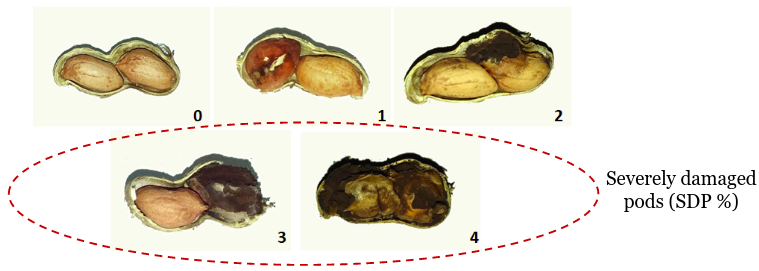
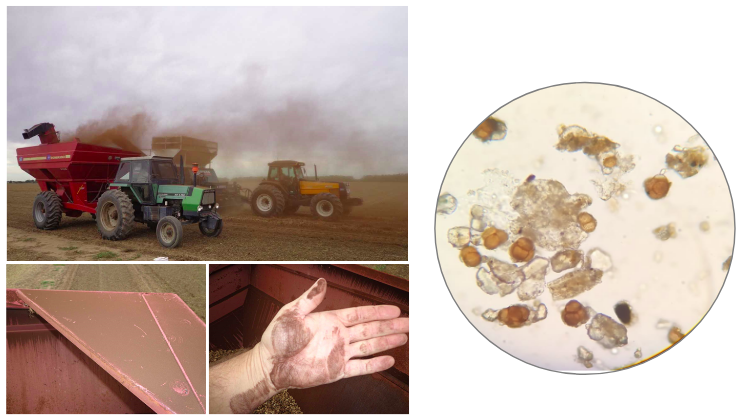
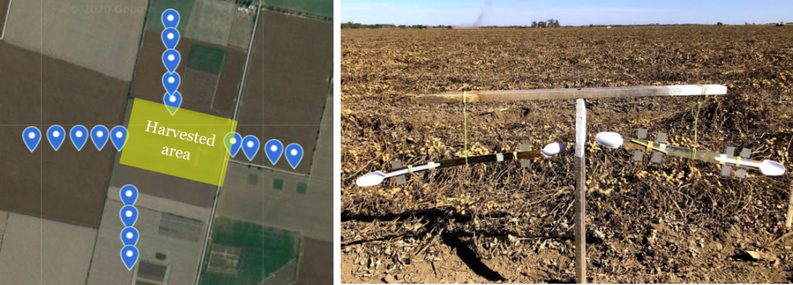

# About

Peanut smut, caused by *Thecaphora frezzi*, has caused significant losses in Argentinian peanut production in recent years.

*T. frezzi* is a soil-borne pathogen with the ability to survive long-term as teliospores in soil.
The pathogen aggressively invades the pods and transforms kernels into a mass of spores.

The main mechanism of inoculum spread is the spore liberation from broken infected pods during the harvest process.

 

There is very limited information available on the amount of spores of *T. frezzi* spread in peanut harvest.
The purposes of this research were to (i) estimate the aerial spore spread of *Thecaphora frezzi* in peanut harvest, (ii) model the dispersion of spores over time and distance based on wind velocity and intensity of peanut smut. 

 

## Data sources

The data collected as a part of this research are available in our GitHub repository.
[Datasets](https://github.com/juanchiem/peanut_smut_aerial/tree/main/data)

## Main outcomes

